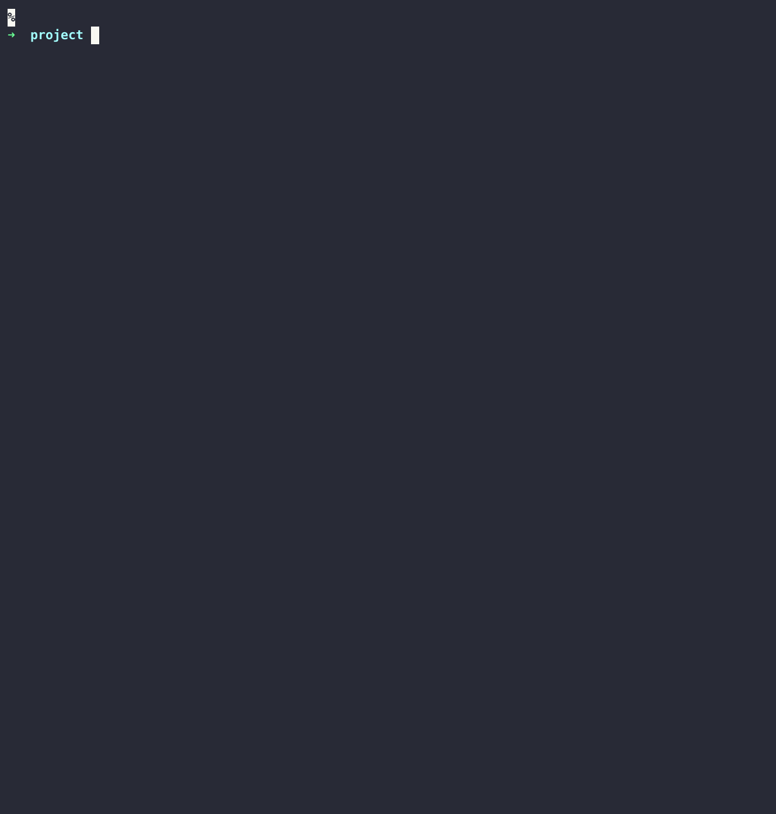

## Developer-centric configurations using a single config for all envrionments, for all vendors!


## Demo



## Quick start
```bash
➜ devx project init
➜ devx project update
➜ devx project gen
➜ devx do dev
🏭 Transforming stack for the "dev" environment...
[compose] applied resources to "build/dev/compose/docker-compose.yml"
[terraform] applied resources to "build/dev/terraform/generated.tf.json"
```

## Usage

### Configuration language
[CUE](https://cuelang.org/) is the result of years of experience writing configuration languages at Google, and seeks to improve the developer experience while avoiding some nasty pitfalls. CUE looks like JSON, but with additional features that enable declarative data definition, generation, and validation to be a breeze. You can find a primer on CUE [here](https://docs.dagger.io/1215/what-is-cue/#understanding-cue).

### Create a stack (by Developers)
A stack is created by the developer to define infrastructure required to run an app.
```cue
package main

import (
	"guku.io/devx/v1"
	"guku.io/devx/v1/traits"
)

stack: v1.#Stack & {
	components: {
		cowsay: {
			v1.#Component
			traits.#Workload
			containers: default: {
				image: "docker/whalesay"
				command: ["cowsay"]
				args: ["Hello DevX!"]
			}
		}
	}
}
```

### Create your own stack builders or use community packages (by Platform Engineers)
```cue
package main

import (
	"guku.io/devx/v1"
	"guku.io/devx/v1/transformers/compose"
)

builders: v1.#StackBuilder & {
	dev: {
		mainflows: [
			v1.#Flow & {
				pipeline: [
					compose.#AddComposeService & {},
				]
			},
		]
	}
}
```

### Validation
```bash
➜ devx project validate
Looks good 👀👌
```

### Platform capability discovery
```bash
➜ devx project discover --transformers
[🏷️  traits] "guku.io/devx/v1/traits"
traits.#Workload	a component that runs a container 
traits.#Replicable	a component that can be horizontally scaled 
traits.#Exposable	a component that has endpoints that can be exposed 
traits.#Postgres	a postgres database 
traits.#Helm	a helm chart using helm repo 
traits.#HelmGit	a helm chart using git 
traits.#HelmOCI	a helm chart using oci 

[🏭 transformers] "guku.io/devx/v1/transformers/argocd"
argocd.#AddHelmRelease	add a helm release  (requires trait:Helm)

[🏭 transformers] "guku.io/devx/v1/transformers/compose"
compose.#AddComposeService	add a compose service  (requires trait:Workload)
compose.#ExposeComposeService	expose a compose service ports  (requires trait:Exposable)
compose.#AddComposePostgres	add a compose service for a postgres database  (requires trait:Postgres)

[🏭 transformers] "guku.io/devx/v1/transformers/terraform"
terraform.#AddHelmRelease	add a helm release  (requires trait:Helm)
```

## Package management

devx can pull CUE code directly from git repositories.

### Create a new packages
Create a new repository to store your packages, you can host multiple packages in the same repository.

```bash
pkg
└── domain.com
    └── package1
        ├── cue.mod
        |   └── module.cue # module: "domain.com/package1"
        └── file.cue
```

### Add the package to `module.cue`
```cue
module: ""

packages: [
  "github.com/<org name>/<repo name>@<revision>/pkg/domain.com",
]		
```

### For private packages (optional)
```bash
export GIT_USERNAME="username"
export GIT_PASSWORD="password"
```
or
```bash
export GIT_PRIVATE_KEY_FILE="path/to/key"
export GIT_PRIVATE_KEY_FILE_PASSWORD="password"

```

### Update packages (pulling updates will replace existing packages)
```
➜ devx project update
```
